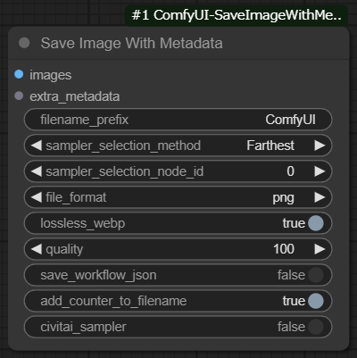

# ComfyUI-SaveImageWithMetaData
  
- [ComfyUI](https://github.com/comfyanonymous/ComfyUI)用のカスタムノードです。
- 各ノードの入力値から取得したメタデータ(PNGInfo)つきの画像を保存するノードを追加します。
- 動的に値を取得するため、色々な拡張機能のノードで出力された値をメタデータに追加することができます。

## インストール手順
```
cd <ComfyUIがあるディレクトリ>/custom_nodes
git clone https://github.com/nkchocoai/ComfyUI-SaveImageWithMetaData.git
```

## 追加されるノード
### Save Image With Metadata
- 入力として受け取った `images` をメタデータ(PNGInfo)つきの画像として保存します。
- メタデータは `sampler_selection_method` で見つけたKSamplerノードの入力と以前に実行されたノードの入力から取得します。
  - 対象となるKSamplerノードは[py/defs/samplers.py](py/defs/samplers.py)と[py/defs/ext/](py/defs/ext/)配下のファイルの`SAMPLERS`のキーです。

#### sampler_selection_method
- このノードよりも前に実行されたKSamplerノードを選ぶ方法を指定します。

##### Farthest
- このノードに最も遠いKSamplerノードを選びます。
- 例: [everywhere_prompt_utilities.png](examples/everywhere_prompt_utilities.png) において、上段のKSamplerノード(seed=12345)を選びます。

##### Nearest
- このノードに最も近いKSamplerノードを選びます。
- 例: [everywhere_prompt_utilities.png](examples/everywhere_prompt_utilities.png) において、下段のKSamplerノード(seed=67890)を選びます。

##### By node ID
- ノードIDが `sampler_selection_node_id` であるKSamplerノードを選びます。

## 付与されるメタデータ
- Positive prompt
- Negative prompt
- Steps
- Sampler
- CFG Scale
- Seed
- Clip skip
- Size
- Model
- Model hash
- VAE
  - KSamplerノードではなくSaveImageWithMetadataノードの入力から参照されます。
- VAE hash
  - KSamplerノードではなくSaveImageWithMetadataノードの入力から参照されます。
- Loras
  - Model name
  - Model hash
  - Strength model
  - Strength clip
- Embeddings
  - Name
  - Hash
- batch size >= 2の場合 : 
  - Batch index
  - Batch size
- Hashes
  - Model, Loras, Embeddings
  - [Civitai](https://civitai.com/)用

## 対応しているノード・拡張機能
- 対応しているノードは以下のファイルをご確認ください。
  - [py/defs/captures.py](py/defs/captures.py)
  - [py/defs/samplers.py](py/defs/samplers.py)
- 対応している拡張機能は以下のディレクトリをご確認ください。
  - [py/defs/ext/](py/defs/ext/)